[TOC]

## 一、项目基本信息

| 条目     | 信息                                                         |
| -------- | ------------------------------------------------------------ |
| 项目名称 | Thysrael Shell                                               |
| 开发者   | xxxxx                                                        |
| 学号     | xxxxxx                                                       |
| 开发语言 | C                                                            |
| 功能描述 | 可以运行带参数的外部命令，支持标准 I/O 重定向，支持多管道连接，有 `cd, quit` 两个内置命令 |
| 文件名   | thyshell.c                                                   |
| 代码量   | 366 行                                                       |
| 参考资料 | 《深入理解计算机系统》第 8 章                                |

---


## 二、基本功能

### 2.1 需求分析

​	对于外部命令的调用，其实其本质可以概括为自己实现一个 `system` 函数 。

​	对于重定向，其实只要在解析命令的时候将重定向符号 `<,>,>>` 单独识别出来，然后记录重定向的文件即可。在调用外部命令前先进行文件的重定向操作，再进行调用即可。

​	对于管道命令，因为题目要求只需要实现两个命令的管道连接即可，可以维护两个命令变量，然后在解析的时候识别出 `|` 的位置，然后据此将其切割为两个命令，然后分别进行重定向，就可以满足要求。但是“两个命令”不具有一般性，所以我拓展成了任意个管道命令的连接，效果会在后面演示，实现原理也会在后面介绍。

### 2.2 shell 程序流

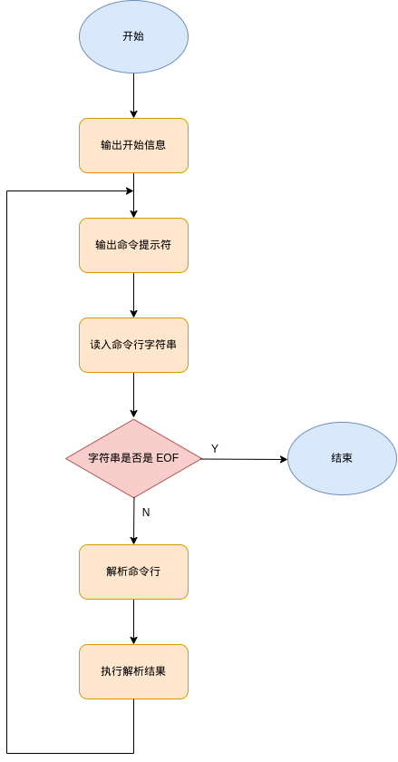

因为解析过程较为复杂，在总流程图中展示过于冗杂。故画子流程图描述解析过程。

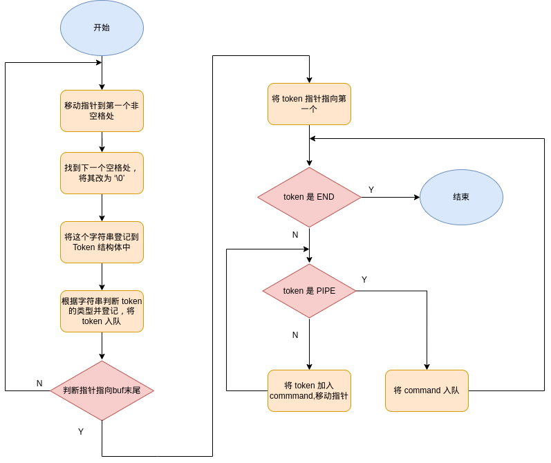

### 2.3 功能展示

#### 2.3.1 具有身份特征的命令行提示符

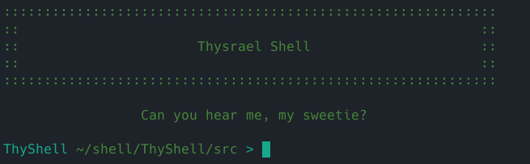

可以看到，在我的 shell 启动的时候，会首先打印 shell 名称 `Thysrael Shell`，然后在每一行的命令提示符的最左侧，都具有 `ThyShell` 的字样，这些都是具有编写者身份特征的字符。编者还特意设计了人性化的问候用语。

#### 2.3.2 运行不带参数的外部命令

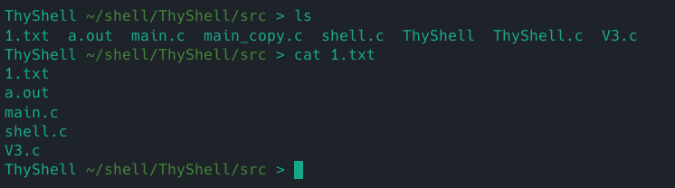

我们挑选 `ls` 作为检验对象，发现可以运行。

#### 2.3.3 支持 I/O 重定向

标准输出的重定向，可以看到无论是 `>` 还是 `>>` 均功能正常

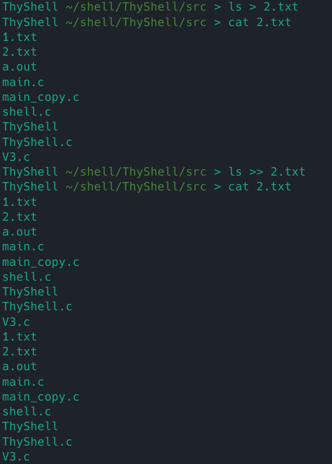

输入重定向

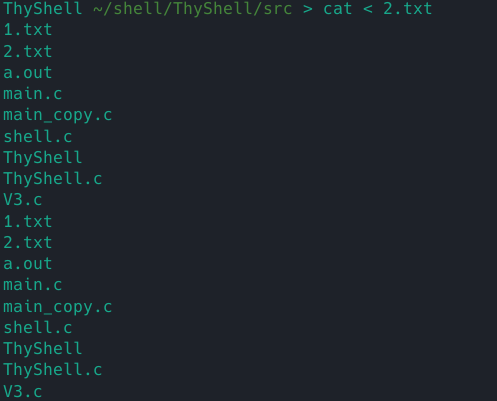

功能正常

#### 2.3.4 管道命令

可以通过管道连接两个命令

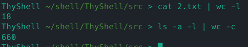

#### 2.3.5 管道与重定向组合

可以看到，无论是输入重定向还是输出重定向与管道结合都没有问题。

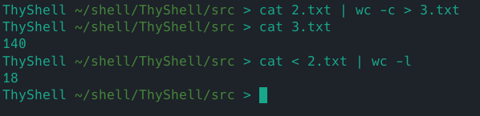

### 2.4 实现与系统调用

#### 2.4.1 外部命令调用

我们可以使用如下函数

```c
int execvp(const char* command, char* argv[]);
```

需要注意的是，这个函数一般不会返回，也就是不会执行其之后的语句，所以如果执行了，那么就是报错。此外，`argv` 的最后一项一定是 `NULL`。

举个例子，比如说我们要输入如下命令

```bash
ls -a -l ~
```

那么对应的参数应该是

```c
command = "ls";
argv = {"ls", "-a", "-l", "~", NULL};
```

需要注意的是，这个函数需要另外开设一个进程去加载，也就是说，还会用到 fork 系统调用

```
fork();
```

#### 2.4.2 I/O 重定向

我用到的函数是

```c
int dup2(int oldfd, int newfd);
```

​	这个函数说的是将 `oldfd` 对应的描述符表项复制到 `newfd` 表项。如果 `newfd` 没有对应文件，那么再次使用 `newfd` 的时候，其对应的文件就是 `oldfd` 文件对应的表项了。如果 `newfd` 有对应的文件，那么 `dup2` 会在复制 `oldfd` 之前关闭 `newfd`。返回值如果是负数，则说明失败了。

举个例子，则是未调用前

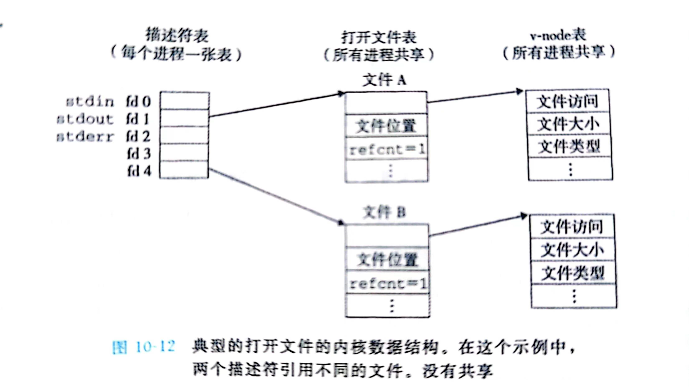

执行语句

```c
dup2(4,1)
```

就成了这样

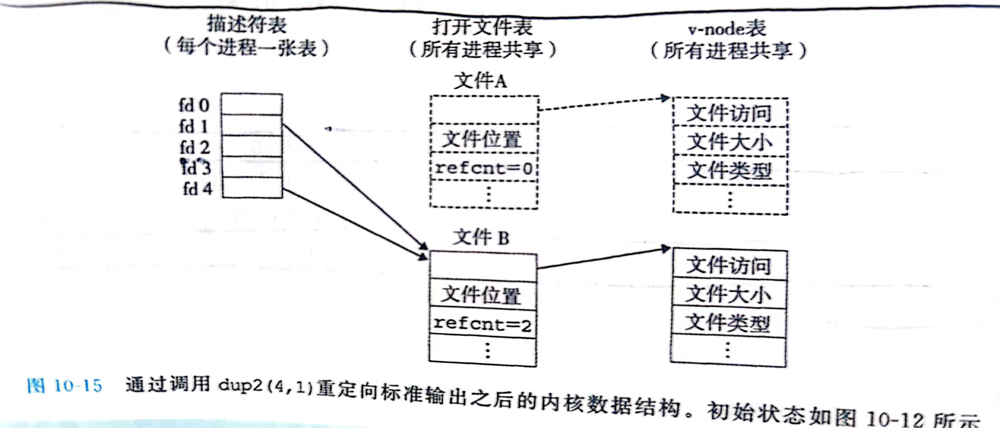

其实这就是对于 `stdout` 的重定向，以后所有对于 `stdout` 的操作都会指向 `fd=4` 的文件。

此外，重定向还涉及文件的开关，需调用如下系统调用

​	在用户进程里可以通过系统调用实现，对于打开文件，我们有

```c
int open(char *filename, int flags, int mode);
```

可以利用。这个函数会打开文件名为 `filename` 的文件，其权限由 `flags` 描述，我们有一系列的宏，并且支持与操作

| 宏       | 含义                                                      |
| -------- | --------------------------------------------------------- |
| O_RDONLY | 只读                                                      |
| O_WRONLY | 只写                                                      |
| O_RDWR   | 可读可写                                                  |
| O_CREAT  | 如果文件不存在，就创建一个截断的（truncated, 即空的）文件 |
| O_TRUNC  | 如果文件已经存在，就截断它                                |
| O_APPEND | 在每次写操作前，设置文件位置到结尾处                      |

`mode` 指定了新文件的访问权限位，同样是有宏定义的，但是就不展开了，一般用 `0666` 就不会发生问题。

这个函数会返回打开文件的文件描述符 `fd` 。

当我们需要关闭一个文件的时候，可以这样

```c
int close(int fd);
```

#### 2.4.3 管道

​	管道也是要建立在前面的理解上的

```c
int pipe(int fd[2]);
```

执行成功返回 `0`，否则返回 `-1`。

成功时会修改 `fd` 数组内容，有规定：fd[0] → r； fd[1] → w。向管道文件读写数据其实是在读写内核缓冲区。无需 `open`，但需要手动 `close`。

其执行有示意图：

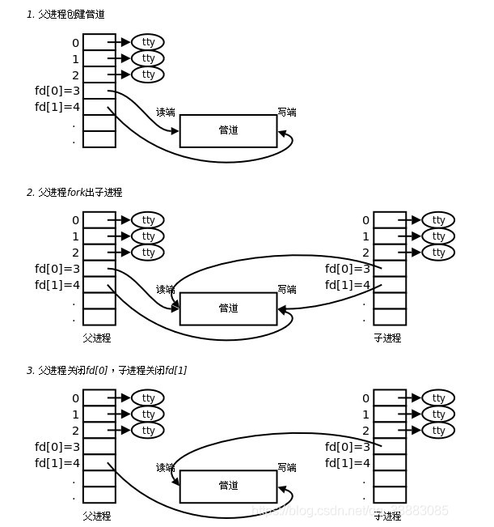

---


## 三、高级功能

### 3.1 打印并压缩路径

​	在命令提示符处，我打印了路径，并且实现了路径的压缩，即当路径中出现家目录的时候，会将 `/home/user_name` 压缩成 `~`

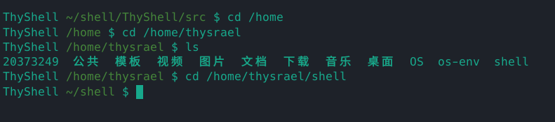

具体的实现方法是调用 `getcwd` 函数，就可以获得当前路径，在借助 `getenv` 函数，就可以获得当前的家目录路径，然后就可以进行比较并压缩，具体的实现代码如下

```c
void print_prompt()
{
    char *path = getcwd(NULL, 0);
    const char *home = getenv("HOME");
    if (strstr(home, path) == 0)
    {
        path[0] = '~';
        size_t len_home = strlen(home);
        size_t len_path = strlen(path);
        memmove(path + 1, path + len_home, len_path - len_home);
        path[len_path - len_home + 1] = '\0';
    }
    printf("ThyShell \033[0;32m%s\033[0m $ ", path);
    free(path);
}
```

### 3.2 quit 内置命令

实现效果如下


具体的方法是将 quit 也视为一个命令，然后在调用外部命令之前先进行判断，如果符合，则直接退出，实现代码如下

```c
int builtin_command(Command command)
{
    if (!strcmp(command.argv[0], "quit"))
    {
		quit();
    }
    else if (!strcmp(command.argv[0], "cd"))
    {
        if (chdir(command.argv[1]) != 0)
        {
            fprintf(stderr, "Error: cannot cd :%s\n", command.argv[1]);
        }
        return 1;
    }

    return 0;
}
```

### 3.3 cd 内置命令

效果演示如下

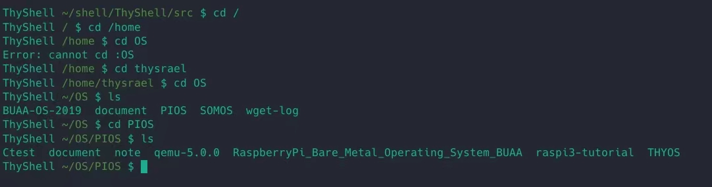

可以看到在用户权限下自由切换，实现的方法是使用 `chdir` 函数。具体的代码在 3.2 节。

### 3.4 错误检测

​	除了正常功能的运行，`ThyShell` 还具有异常检测功能，其可以检测 fork 异常，waitpid 异常和语法异常，具体的实现为将系统调用函数进行包装，这样既保证了功能的正常，也使代码具有简洁性，具体实现如下

```c
void unix_error(char *msg)
{
	fprintf(stderr, "%s: %s\n", msg, strerror(errno));
	exit(0);
}

pid_t Fork()
{
	pid_t pid;
	if ((pid = fork()) < 0)
	{
		unix_error("Fork error");
	}
	return pid;
}

void Wait(pid_t pid)
{
	int status;
	waitpid(pid, &status, 0);
	if (!WIFEXITED(status))
	{
		printf("child %d terminated abnormally\n", pid);
	}
}
```

### 3.5 多管道命令

`ThyShell` 可以实现多管道命令，具体演示如下：

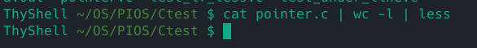

输入 `cat filename | wc -l | less` 可以出现如下图样


说明功能正常。

具体的实现可以参照流程图，思想是将命令行抽象成一个单独的层次，命令行可以包括一个或者多个命令。当出现管道命令的时候，需要开启管道后进行重定向。

### 3.6 带参数命令

这个在解析命令行的时候即可实现，参数会作为 `execvp` 的参数传递，具体实现如下

```c
execvp(command.argv[0], command.argv);
```

### 3.7 字符串类型的检测

在输入 `echo, grep` 等命令的时候，我们的参数是字符串类型的，这个时候需要对于引号单独处理，我的做法是做了一个简单的栈结构，最后效果如图：

​	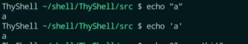 
